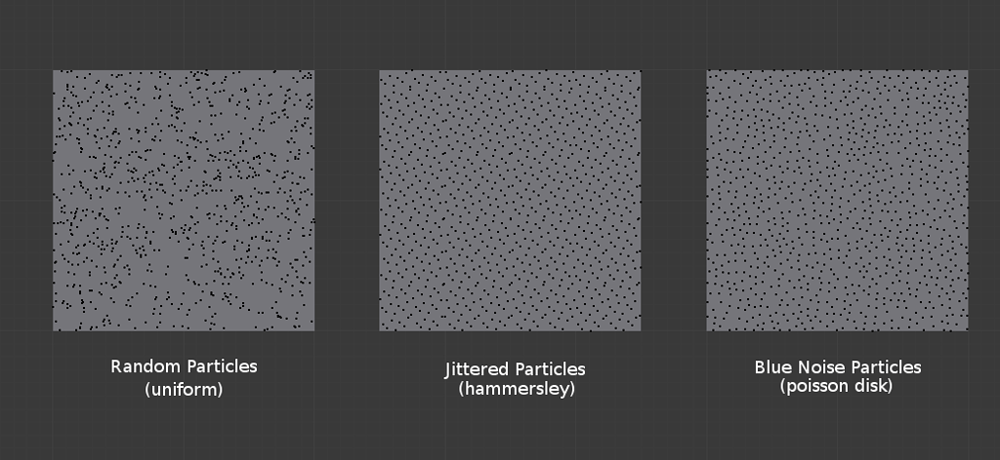

# ᴘᴏɪꜱꜱᴏɴ ᴅɪꜱᴄ
A Poisson Disc sampling algorithm implementation written in Javascript.\
Created for use in the [SubForest](https://github.com/BotLed/SubForest) project to achieve evenly spaced generation of objects.\

*"Is it Possion Disc, or Poisson Disk?"*
